# Ex-09-Data-Visualization-

## AIM
To Perform Data Visualization on a complex dataset and save the data to a file. 

# Explanation
Data visualization is the graphical representation of information and data. By using visual elements like charts, graphs, and maps, data visualization tools provide an accessible way to see and understand trends, outliers, and patterns in data.

# ALGORITHM
### STEP 1
Read the given Data
### STEP 2
Clean the Data Set using Data Cleaning Process
### STEP 3
Apply Feature generation and selection techniques to all the features of the data set
### STEP 4
Apply data visualization techniques to identify the patterns of the data.


# CODE
```
Developed by: Barath S
Register No: 212222230018
```
```python
import seaborn as sns
import pandas as pd
import matplotlib.pyplot as plt

df = sns.load_dataset("tips")
print(df)

df.isnull().sum()

plt.figure(figsize=(5,5))
plt.title("Data with Outliers")
df.boxplot()
plt.show

plt.figure(figsize=(5,5))
cols = ['size','tip','total_bill']
Q1 = df[cols].quantile(0.25)
Q3 = df[cols].quantile(0.75)
IQR = Q3 - Q1
df = df[~((df[cols] < (Q1 - 1.5 * IQR))| (df[cols] > (Q3 + 1.5 * IQR))).any(axis=1)]
plt.title("Dataset after removing outliers")
df.boxplot()
plt.show()

sns.boxplot(x = df['day'], y = df['total_bill'],hue = df['day'])
plt.legend(loc = 'center')
plt.title("Highest total bill amount by the day of the week")
plt.show()

sns.boxplot(x=df['smoker'], y = df['tip'], hue=df['smoker'])
plt.title("Average tip amount given by the smoker and non-smoker")

df['tip_percent'] = df['tip'] / df['total_bill']
sns.scatterplot(x = df['size'], y = df['tip_percent'],data = df)
plt.title("tip percentage by dinning party size")

sns.boxplot(x=df['sex'], y = df['tip'],hue = df['sex'])
plt.title("Tip based on the gender")

sns.scatterplot(x=df['day'], y=df['total_bill'], hue = df['day'])
plt.legend(loc = "best")
plt.title("Total bill amount by the day of the week")

sns.histplot(data = df,x= 'total_bill',hue='time',element='step',stat = 'density')
plt.title("Distribution of total bill amount by time of the day")
plt.show()

sns.barplot(x=df['size'], y=df['total_bill'], hue=df['size'])
plt.title("Average total bill amount by dining party size")
plt.show()

sns.boxplot(x = 'day', y = 'tip', data = df)
plt.title("Tip amount by the day of the week")
plt.show()

sns.violinplot(x='time',y='tip',data=df)
plt.title("Tip amount by time of day")
plt.show()

sns.scatterplot(x='total_bill',y='tip',data = df)
plt.title("Correlation between tip amount and total bill amount")
plt.show()
```

# OUPUT
## Dataset

## isnull().sum()
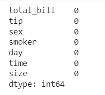
## Dataset with outliers
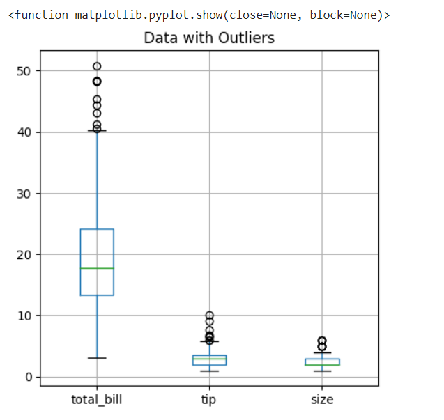
## Dataset without outliers
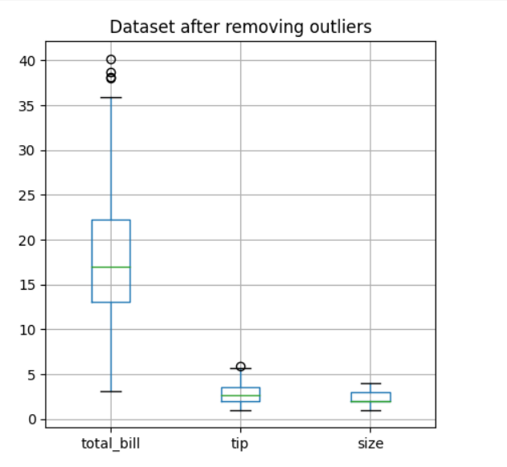
## Which day of the week has the highest total bill amount?
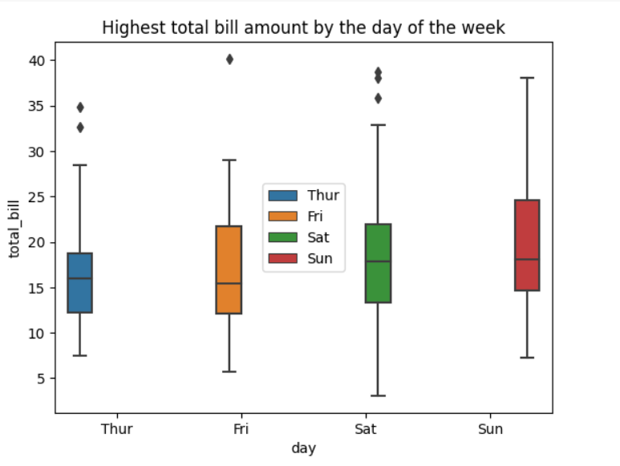
## What is the average tip amount given by smokers and non-smokers?
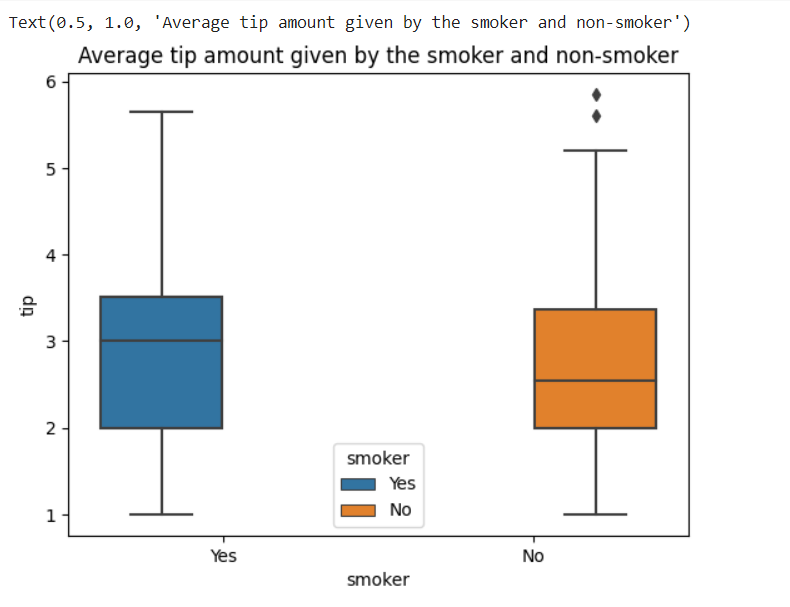
## How does the tip percentage vary based on the size of the dining party?
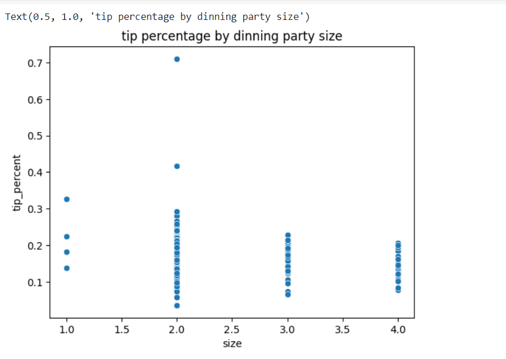
## Which gender tends to leave higher tips?
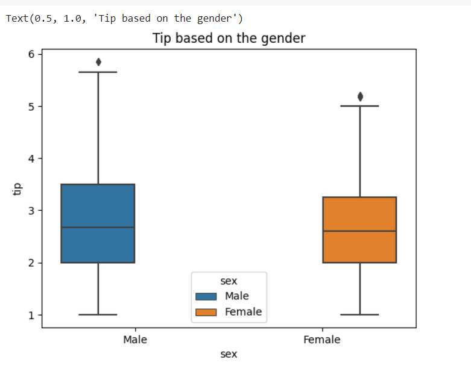
## Is there any relationship between the total bill amount and the day of the week?
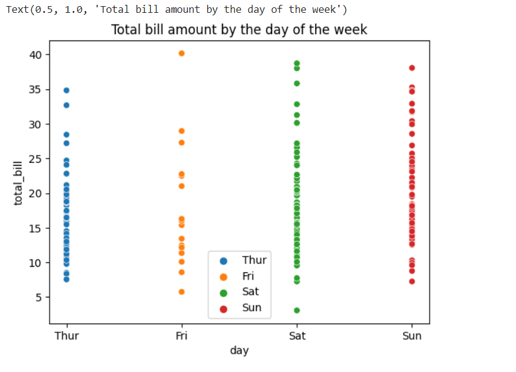
## How does the distribution of total bill amounts vary across different time periods (lunch vs. dinner)?
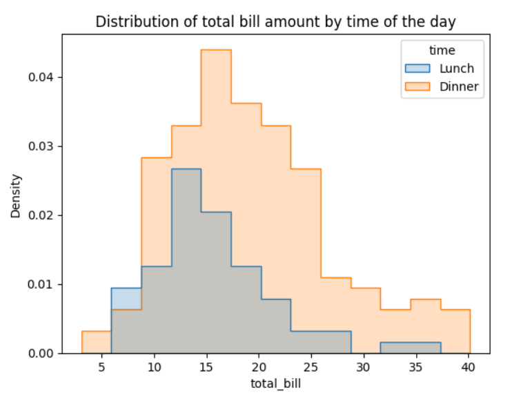
## Which dining party size group tends to have the highest average total bill amount?
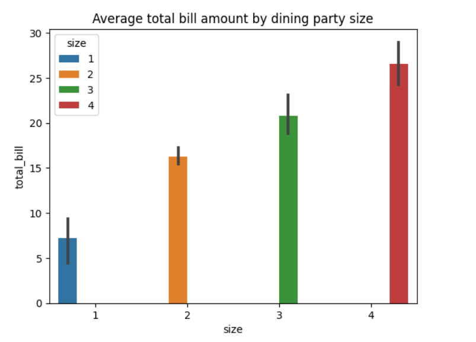
## What is the distribution of tip amounts for each day of the week?
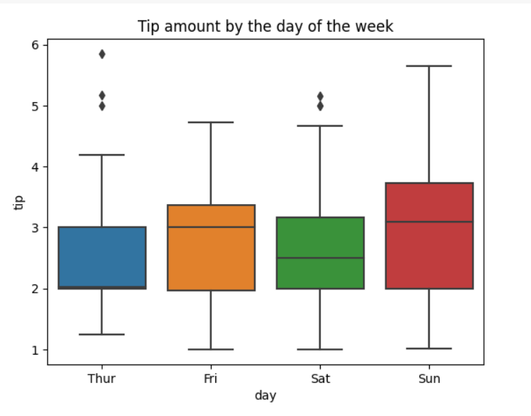
## How does the tip amount vary based on the type of service (lunch vs. dinner)?
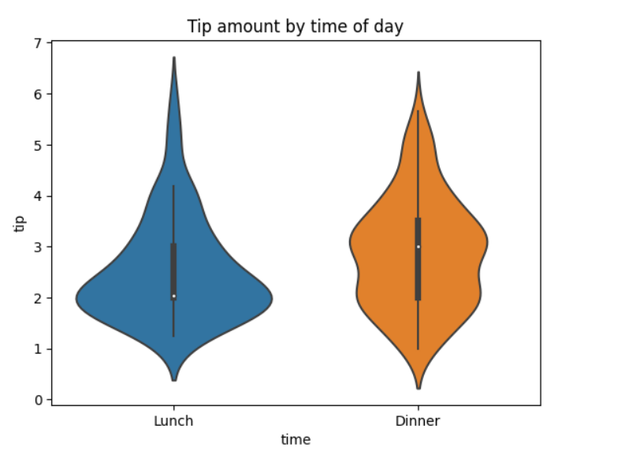
## Is there any correlation between the total bill amount and the tip amount?
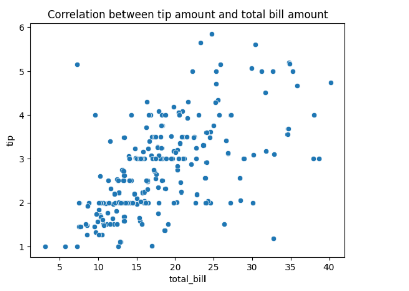

## RESULT:
Thus, a program To Perform Data Visualization on a complex dataset and save the data to a file is done successfully.
